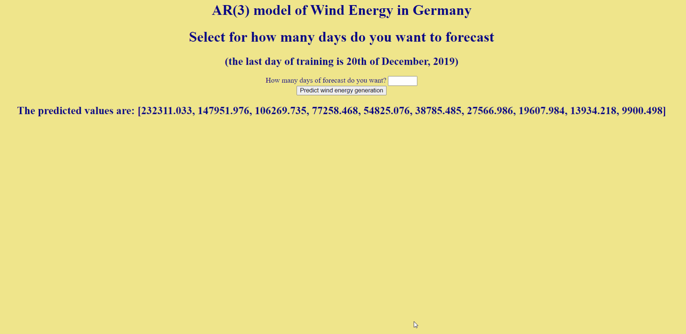

## Wind energy in Germany - Time series analysis and forecast

In this project we will analyze a dataset which consists of 1094 daily observations related to the wind
energy production of a German plant from 01-01-2017 to 12-30-2019.

The original project was made together with 3 university colleagues of mine for the course "Time Series Analysis" (it was implemented in R). The approaches used are:

* a simple Autoregressive model
* an autoregressive model with exogeneous variables (*wind capacity and temperature*)

The order of the first one is direcly choosen by looking at the autocorrelation (partial), while for the second one the criteria are BIC and AIC.

After the exam, I decided to convert the original R project to Python language and then create by myself a **web-app** using **flask** that allows the user to select a **specific forecast period** to obtain the values from the trained model.

#### How to use it:

After repo download:

* usual `pip install -r requirements.txt` in your environment
* then, from terminal `python app.py`
* copy and paste http://127.0.0.1:5000/predictdata in your browser (‼️ **while running `app.py`** ‼️ )
* then just put the number of days (integer) from 1 to 59 (because after the 59th day the prediction will be 0)

